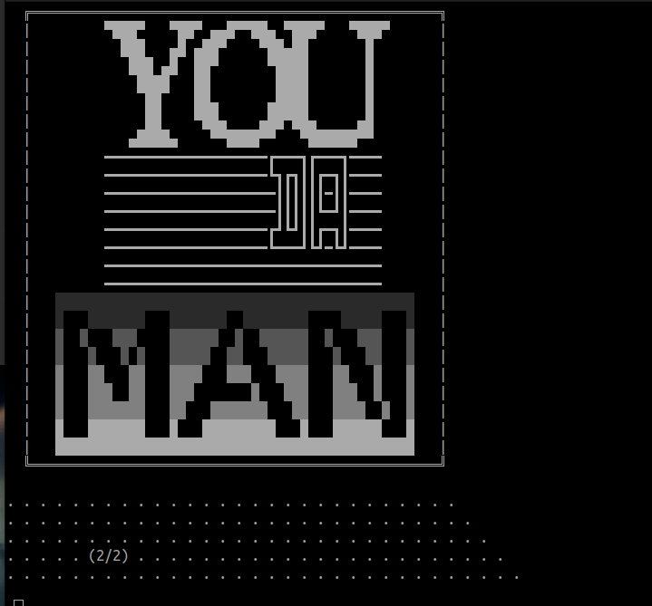

# Who da man?

## What is this script?
Good question. This is a bash shell script that will remind you who da man whenever you are feeling down. The way it works is simple: you call the script and then you will be prompted to ask who da man is. At this point please say:
`Who da man?`
If you fail to ask who the man is, the script will prompt you again until you close the program/your computer dies/the sun explodes/etc.

Once you successfully ask who da man is, you will be fed entertaining ascii aristry informing you who da man really is.

Then stick figures of people dancing will be echo'd to your standard output:

      o/   o/   o/
     <|   <|   <|
      />   />   />

Then, after all that, you should be able to rest safely at night secure in the knowledge that you are, indeed, da man.

    (•_•)
    ( •_•)>⌐■-■
    (⌐■_■)

Many thanks to [this online text to ascii-art converter](https://texteditor.com/multiline-text-art/), without whom this bash script would have taken 10x longer to build.

## Installation instructions
To install this, first clone the git repository:

`git clone https://github.com/604adrian/who-da-man.git`

Then go to the repository:

`cd who-da-man`

Then make make the script executable (if it isn't already):

`chmod +x da-man.sh`

Then create a symbolic link so that you can call the script even when you are out of the file:

`sudo ln -s "$(pwd)/da-man.sh" /usr/local/bin/da-man.sh`

Finally, you can create an alias that makes calling the script easier.

### On Linux
Open your ~/.bashrc file with your text editor of choice (I'll use vim):

`vim ~/.bashrc`

Then write an alias, like (for example):

`alias peekaboo='da_man.sh'`

Save it, then exit the text editor. Then refresh your .bashrc file:

`source ~/.bashrc`

And you're done! You can now call da-man.sh from anywhere on your machine using your alias! Safe travels and remember: you da man.

### On Mac
Open your ~/.bash_profile file with your text editor of choice (I'll use vim):

`vim ~/.bash_profile`

Then write an alias:

`alias mancheck='da-man.sh'`

Save it, exit the text editor, then refresh your .bash_profile file:

`source ~/.bash_profile`

And now you're done! You can call da-man.sh from anywhere on your machine using your alias! Have fun affirming your masculinity!

### On Windows
Follow the steps given [here](https://letmegooglethat.com/?q=how+to+delete+windows+operating+system).

Then go [here](https://www.linux.org/pages/download/).

Then go back to line 46 of this document.

## In conclusion
Who da man?

You da man.
